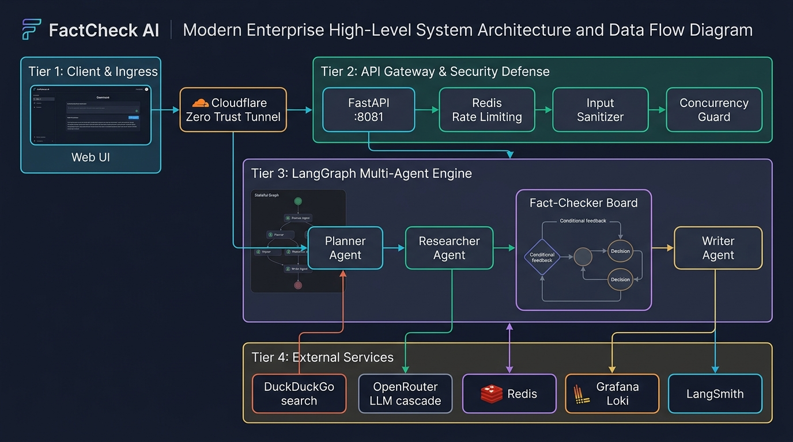
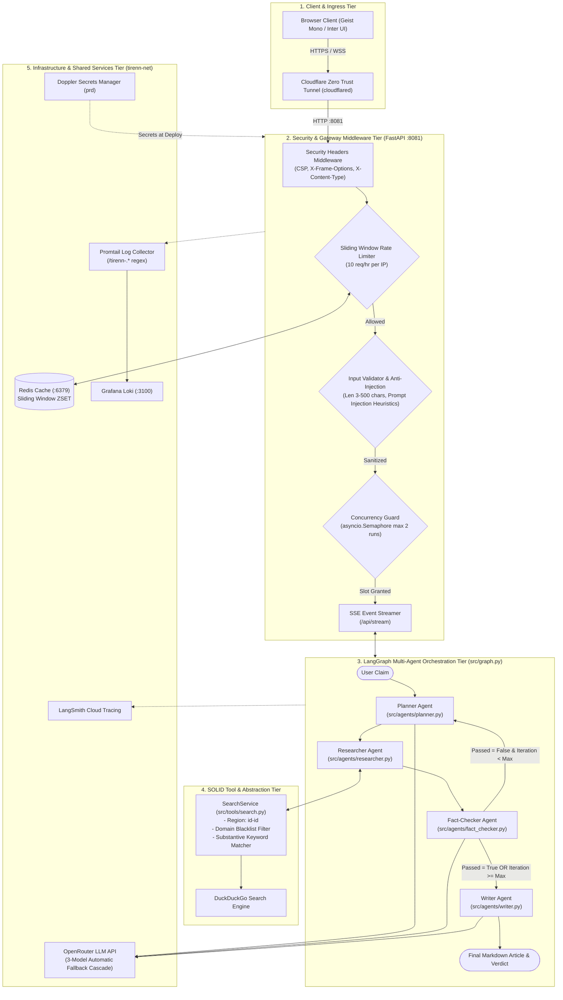
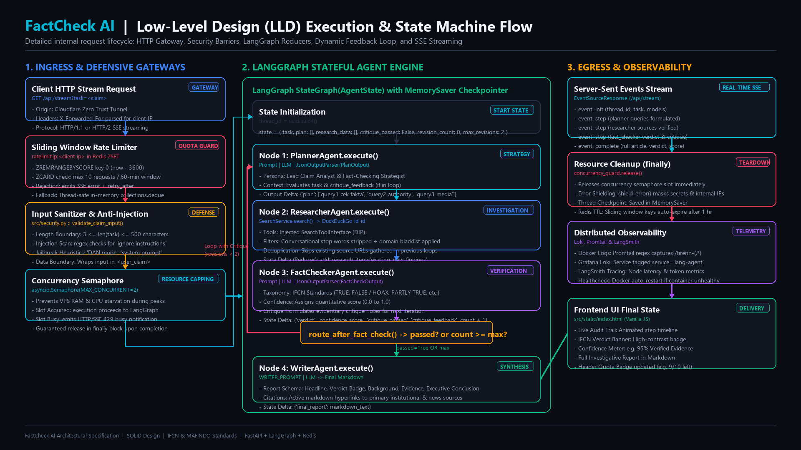

# System Architecture Specification: FactCheck AI

## Autonomous Multi-Agent Hoax & Misinformation Verification Engine

FactCheck AI is an enterprise-grade autonomous intelligence system engineered to verify viral rumors, breaking news claims, and online hoaxes under **International Fact-Checking Network (IFCN)** standards and **MAFINDO** classification taxonomy.

The system is built upon **LangGraph**, **FastAPI**, **LangChain**, **LangSmith**, and **OpenRouter**, adhering strictly to **SOLID design principles**, a **3-layer defensive security perimeter**, and a **microservice container mesh** on a private Docker network (`tirenn-net`).

---

## 1. High-Level Design (HLD) Architecture



### 1.1 Architectural Overview & Tier Structure

As visualized in the architecture blueprint above, **FactCheck AI** is organized into four distinct horizontal tiers designed to deliver strict separation of concerns, enterprise-grade defense, and cyclical agent self-correction:

1. **Tier 1: Client & Ingress Tier**
   - **Web UI**: Modern dark-mode interface (Geist Mono, Inter, `#09090b` zinc) featuring live SSE audit trails, IFCN verdict badges, and dynamic rate-limit counters.
   - **Cloudflare Zero Trust Tunnel (`cloudflared`)**: Direct encrypted outbound tunnel connecting Cloudflare's edge to the internal container network (`tirenn-net`), eliminating the need for open public ports.

2. **Tier 2: API Gateway & Security Defense (FastAPI :8081)**
   - **FastAPI Core**: High-performance asynchronous ASGI web framework handling requests and Server-Sent Events (SSE).
   - **Redis Sliding Window Rate Limiting**: Enforces a rolling 10 requests/hour limit per client IP using Redis Sorted Sets (`ZSET`).
   - **Input Sanitizer & Anti-Injection**: Validates character boundaries (3–500 chars) and scans for adversarial jailbreak attacks (*"ignore instructions"*, *"DAN mode"*), isolating inputs into `<user_claim>` XML tags.
   - **Concurrency Guard**: `asyncio.Semaphore(2)` capping simultaneous intensive research cycles to protect VPS compute resources.

3. **Tier 3: LangGraph Multi-Agent Engine**
   - **Stateful Graph Orchestration**: Cyclic state machine managing inter-agent communication and state accumulation.
   - **Planner Agent**: Deconstructs rumors into 3–4 targeted keyword queries for fact archives, authorities, and credible media.
   - **Researcher Agent**: Coordinates web retrieval, enforces domain blacklists, and deduplicates source URLs.
   - **Fact-Checker Board**: Cross-examines gathered sources against the claim under IFCN/MAFINDO standards. If evidence is inadequate, it triggers a **conditional feedback loop** back to the Planner; otherwise, it passes to the Writer.
   - **Writer Agent**: Synthesizes verified evidence into an objective, publication-ready Markdown fact-check report.

4. **Tier 4: External Services & Infrastructure**
   - **DuckDuckGo Search Engine**: Region-targeted (`id-id`) search execution with blacklist and keyword relevance heuristics.
   - **OpenRouter LLM Cascade**: Resilient 3-model automatic fallback cascade mitigating upstream 429 rate limits.
   - **Redis Cache (:6379)**: Distributed store for sliding window rate limiter timestamps.
   - **Grafana Loki & Promtail**: Distributed structured logging capturing container stdout via `/tirenn-(.*)` regex.
   - **LangSmith**: Node-by-node tracing, token consumption tracking, and latency observability.

---

### 1.2 Interactive Flowchart Diagram



---

## 2. Low-Level Design (LLD) Execution & State Machine Flow



### 2.1 Step-by-Step Internal Execution Pipeline

The Low-Level Design (LLD) diagram above details the exact function-level execution, data transformations, security barriers, and state transitions that occur during each verification request:

#### Phase 1: Ingress & Defensive Security Gateways
1. **Client Request Ingestion (`src/server.py`)**:
   - Inbound HTTP GET request to `/api/stream?task=<claim>` via Cloudflare Tunnel.
   - `extract_client_ip(request)` reads `X-Forwarded-For` header to resolve the real client IP behind proxy hops.
2. **Sliding Window Rate Limiter (`src/security.py`)**:
   - Executes atomic Redis commands: `ZREMRANGEBYSCORE ratelimit:ip:<client_ip> 0 (now - 3600)` followed by `ZCARD`.
   - If count $\ge 10$, rejects request with SSE error event and `retry_after` countdown.
   - If count $< 10$, logs timestamp via `ZADD` and sets 1-hour key expiry. Seamlessly defaults to thread-safe `collections.deque` if Redis is offline.
3. **Input Sanitizer & Prompt Injection Defense (`src/security.py`)**:
   - Validates claim string length: $3 \le \text{length} \le 500$ characters.
   - Evaluates regex patterns for jailbreak strings (*"ignore previous instructions"*, *"DAN mode"*, *"system prompt"*).
   - Encapsulates payload in `<user_claim>` XML isolation boundaries to prevent LLM instruction hijacking.
4. **Concurrency Guard (`src/security.py`)**:
   - Calls `await concurrency_guard.acquire()` using an `asyncio.Semaphore(2)`.
   - If 2 analyses are already running, immediately emits an engine busy notice to protect VPS memory and CPU.

#### Phase 2: LangGraph State Machine & Agent Execution
5. **State Initialization (`src/server.py` & `src/state.py`)**:
   - Assigns a unique `thread_id = str(uuid.uuid4())` configured into `MemorySaver` checkpointer.
   - Emits SSE event `type: "init"` containing session parameters and active model assignments.
   - Seeds initial immutable `AgentState`:
     ```python
     state = {
         "task": sanitized_task,
         "plan": [],
         "research_data": [],
         "critique_feedback": None,
         "critique_passed": False,
         "revision_count": 0,
         "max_revisions": 2
     }
     ```
6. **Planner Node Execution (`PlannerAgent.execute()`)**:
   - Binds `PLANNER_PROMPT` with task and optional previous `critique_feedback`.
   - Invokes chain: `ChatPromptTemplate | llm | JsonOutputParser(PlanOutput)`.
   - Cleans output queries via `clean_query()` (stripping conversational stop words).
   - Emits SSE event `type: "step"`, `node: "planner"`.
7. **Researcher Node Execution (`ResearcherAgent.execute()`)**:
   - Injected with `SearchToolInterface` (`SearchService`).
   - Executes DuckDuckGo queries targeted at `id-id` with 0.35s rate pacing.
   - Filters out domain blacklist (e-commerce, gadget specs, quiz spam) and verifies keyword relevance.
   - Deduplicates findings against prior URLs.
   - Emits state delta via reducer: `add_research_items(existing, new)`.
   - Emits SSE event `type: "step"`, `node: "researcher"`.
8. **Fact-Checker Node Execution (`FactCheckerAgent.execute()`)**:
   - Formats evidence list and evaluates claim against IFCN/MAFINDO classification taxonomy.
   - Assigns official verdict, confidence score ($0.0 \dots 1.0$), and critique notes.
   - Increments `revision_count += 1`.
   - Emits SSE event `type: "step"`, `node: "fact_checker"`.
9. **Conditional Routing Decision (`route_after_fact_check()`)**:
   - Evaluates:
     ```python
     if state["critique_passed"] or state["revision_count"] >= state["max_revisions"]:
         return "writer"
     return "planner"  # Loop back with critique feedback
     ```
   - If rejected and under iteration limit: routes back to **Planner** with critique notes to fill evidentiary gaps.
   - If verified or threshold reached: routes forward to **Writer**.
10. **Writer Node Execution (`WriterAgent.execute()`)**:
    - Synthesizes findings into an objective, publication-ready investigative report in Markdown.
    - Structures article: `# [FACT CHECK] Headline`, `## Verification Verdict Badge`, `## Circulating Claim`, `## Fact Investigation`, `## Executive Conclusion`, and `## Verified Sources`.
    - Emits SSE event `type: "step"`, `node: "writer"`.

#### Phase 3: Egress Streaming & Teardown
11. **Final Delivery & Resource Cleanup (`src/server.py`)**:
    - Emits final SSE event `type: "complete"` with full report, verdict banner, and confidence score.
    - Inside ASGI `finally:` block, calls `concurrency_guard.release()`, freeing the semaphore slot for queued requests.
    - If exceptions occur, `shield_error()` sanitizes tracebacks, masking internal IPs, container names, and API keys.

---

## 3. End-to-End Request Lifecycle

```mermaid
sequenceDiagram
    autonumber
    actor User as Client Browser
    participant Gateway as FastAPI Gateway (:8081)
    participant Sec as Security Engine (Redis / Filter)
    participant Graph as LangGraph Engine
    participant LLM as OpenRouter LLM Cascade
    participant Search as SearchService (DDG)

    User->>Gateway: GET /api/stream?task=claim
    Gateway->>Sec: Check Rate Limit (IP) & Concurrency
    Sec-->>Gateway: Quota OK, Slot Acquired
    Gateway->>Sec: Validate Input & Prompt Injection Scan
    Sec-->>Gateway: Input Sanitized (user_claim XML boundary)
    Gateway-->>User: SSE Event: type="init" (Session ID, Models)

    rect rgb(20, 24, 33)
        note over Graph: Multi-Agent Execution Cycle
        Gateway->>Graph: Execute Graph(initial_state)
        Graph->>LLM: Planner: Formulate 3-4 fact queries
        LLM-->>Graph: Queries Generated
        Graph-->>User: SSE Event: node="planner" (Queries)

        Graph->>Search: Researcher: Execute Search Queries
        Search-->>Graph: Filtered & Deduplicated Evidence
        Graph-->>User: SSE Event: node="researcher" (Sources)

        Graph->>LLM: Fact-Checker: Evaluate Evidence & Render Verdict
        LLM-->>Graph: Verdict + Confidence + Passed Flag
        Graph-->>User: SSE Event: node="fact_checker" (Verdict & Critique)

        alt Evidence Inadequate & Revisions < Max
            Graph->>LLM: Planner: Re-plan with Critique Feedback
            note over Graph: Self-Correction Loop repeats
        else Evidence Sufficient OR Revisions >= Max
            Graph->>LLM: Writer: Synthesize IFCN Report
            LLM-->>Graph: Markdown Report Drafted
            Graph-->>User: SSE Event: node="writer" (Status)
        end
    end

    Graph-->>Gateway: Final State (Report, Verdict, Confidence)
    Gateway-->>User: SSE Event: type="complete" (Full Report, Verdict Banner)
    Gateway->>Sec: Release Concurrency Slot & Update Quota
```



---

## 4. SOLID Architecture Implementation

All agents and services adhere to the five SOLID principles:

| Principle | Architectural Implementation in FactCheck AI |
| :--- | :--- |
| **S — Single Responsibility (SRP)** | Every agent has one reason to change: `PlannerAgent` only plans queries, `ResearcherAgent` only gathers evidence, `FactCheckerAgent` only judges truth, and `WriterAgent` only formats articles. `SearchService` isolates network I/O from business rules. |
| **O — Open/Closed (OCP)** | New agents (e.g. `SocialMediaHarvester`, `ImageVerifier`) extend `BaseAgent` without modifying existing agent code or altering the core LangGraph state machine. |
| **L — Liskov Substitution (LSP)** | Every agent inherits from `BaseAgent` and implements `execute(state: AgentState) -> Dict[str, Any]` and `__call__(state)`. Any agent can be invoked interchangeably as a LangGraph node. |
| **I — Interface Segregation (ISP)** | Agents and tools depend only on minimal, focused interfaces (e.g. `SearchToolInterface` with only `search(query, max_results)`). |
| **D — Dependency Inversion (DIP)** | `ResearcherAgent` receives `SearchToolInterface` via constructor injection rather than directly instantiating search SDKs. Agents resolve models via `get_agent_llm()` rather than hardcoding vendor clients. |

---

## 5. Security Architecture Specification

### 1. Sliding Window Rate Limiter
* **Algorithm**: Sliding Window Log using Redis Sorted Sets (`ZSET`).
* **Keys**: `ratelimit:ip:<client_ip>`.
* **Execution**:
  1. `ZREMRANGEBYSCORE key 0 (now - 3600)`: Purges requests older than 1 hour.
  2. `ZCARD key`: Counts requests within the active 60-minute window.
  3. If count $\ge 10$: Blocks request with HTTP 429 and returns `Retry-After` seconds.
  4. If count $< 10$: `ZADD key now now` and sets 1-hour expiration.

### 2. Prompt Injection Defense
* **Heuristic Pattern Scanning**: Regex detector scans for adversarial jailbreak phrases (*"ignore previous instructions"*, *"system prompt"*, *"developer message"*, *"DAN mode"*).
* **Tag Boundary Isolation**: Claims are sanitized and enclosed within `<user_claim>{task}</user_claim>`. System prompts explicitly command the LLM to treat anything inside the tag as untrusted external text.

### 3. Information Disclosure Shielding
* **Automated Redaction (`shield_error`)**: Error interceptor masks API keys (`sk-...`, `lsv2_...`), internal container names (`tirenn-lang-agent`, `postgres:5432`, `redis:6379`), and private IPs (`10.x.x.x`, `172.x.x.x`) before streaming error payloads to users.

### 4. HTTP Security Headers
* `X-Frame-Options: DENY`
* `X-Content-Type-Options: nosniff`
* `X-XSS-Protection: 1; mode=block`
* `Referrer-Policy: strict-origin-when-cross-origin`
* `Content-Security-Policy: default-src 'self'; script-src 'self' 'unsafe-inline' https://cdn.tailwindcss.com https://cdn.jsdelivr.net; ...`

---

## 6. Shared State Schema (src/state.py)

```python
class ResearchItem(TypedDict):
    """Represents a single verified source or evidence item."""
    query: str       # Search query that yielded the result
    source_url: str  # Direct URL to the primary source
    title: str       # Headline of the article
    snippet: str     # Extracted factual excerpt

def add_research_items(existing: List[ResearchItem], new: List[ResearchItem]) -> List[ResearchItem]:
    """LangGraph reducer accumulating evidence across revision loops."""
    return (existing or []) + (new or [])

class AgentState(TypedDict):
    """Shared workflow state passed across all multi-agent nodes."""
    task: str                                                        # Original claim
    plan: List[str]                                                  # Search queries
    research_data: Annotated[List[ResearchItem], add_research_items]  # Accumulated evidence
    critique_feedback: Optional[str]                                 # Review critique notes
    critique_passed: bool                                            # Fact-check passed flag
    revision_count: int                                              # Current loop count
    max_revisions: int                                               # Loop guard threshold (default: 2)
    planner_model: Optional[str]                                     # Model override
    researcher_model: Optional[str]                                  # Model override
    fact_checker_model: Optional[str]                                # Model override
    writer_model: Optional[str]                                      # Model override
    verdict: Optional[str]                                           # IFCN verdict
    confidence_score: Optional[float]                                # Score 0.0 - 1.0
    final_report: Optional[str]                                      # Synthesized Markdown
```

---

## 7. Directory & File Mapping

```
├── .github/
│   ├── CODEOWNERS              # Repository code ownership definition (@tirenn)
│   └── workflows/
│       ├── ci.yml              # PR validation (compilation, module imports, compose config)
│       └── deploy.yml          # Tag deployment via SSH & Doppler (v1.0.0-core)
├── docs/
│   ├── architecture_diagram.png    # High-Level Design (HLD) architecture blueprint
│   └── low_level_flow_diagram.png  # Low-Level Design (LLD) state machine execution flow
├── doppler.yaml                # Doppler configuration (project: lang, config: prd)
├── Dockerfile                  # Production Python 3.11-slim container
├── docker-compose.yml          # Container orchestration (:8081, tirenn-net external network)
├── Makefile                    # Developer automation targets
├── requirements.txt            # Pinned dependencies (LangGraph, FastAPI, Redis, etc.)
├── ARCHITECTURE.md             # Complete technical architecture specification (this file)
├── main.py                     # Interactive CLI execution runner
└── src/
    ├── state.py                # TypedDict AgentState schema and reducers
    ├── config.py               # Model resolver with OpenRouter 3-model fallback
    ├── security.py             # Rate limiter, input validation, error shielding, CSP
    ├── graph.py                # LangGraph StateGraph assembly and routing
    ├── server.py               # FastAPI server and SSE streaming endpoint
    ├── evaluate.py             # LangSmith automated evaluation suite
    ├── tools/
    │   └── search.py           # SearchService (DDG, domain blacklist, keyword filter)
    ├── agents/
    │   ├── base.py             # BaseAgent abstract class & SearchToolInterface
    │   ├── planner.py          # PlannerAgent: Claim deconstruction & query planning
    │   ├── researcher.py       # ResearcherAgent: Evidence retrieval & deduplication
    │   ├── fact_checker.py     # FactCheckerAgent: IFCN verdict & critique evaluation
    │   └── writer.py           # WriterAgent: Investigative report synthesizer
    └── static/
        └── index.html          # Editorial dark-mode UI with live quota & audit trail
```
