# System Architecture Specification: FactCheck AI

## Autonomous Multi-Agent Hoax & Misinformation Verification Engine

FactCheck AI is an enterprise-grade autonomous intelligence system engineered to verify viral rumors, breaking news claims, and online hoaxes under **International Fact-Checking Network (IFCN)** standards and **MAFINDO** classification taxonomy.

The system is built upon **LangGraph**, **FastAPI**, **LangChain**, **LangSmith**, and **OpenRouter**, adhering strictly to **SOLID design principles**, a **3-layer defensive security perimeter**, and a **microservice container mesh** on a private Docker network (`tirenn-net`).

---

## 1. High-Level Design (HLD) Diagram

```mermaid
flowchart TD
    %% Client & Ingress Tier
    subgraph Tier1 [1. Client & Ingress Tier]
        Client["Browser Client (Geist Mono / Inter UI)"]
        CF["Cloudflare Zero Trust Tunnel (cloudflared)"]
        Client -->|HTTPS / WSS| CF
    end

    %% Security & Gateway Middleware Tier
    subgraph Tier2 [2. Security & Gateway Middleware Tier (FastAPI :8081)]
        SecHeaders["Security Headers Middleware\n(CSP, X-Frame-Options, X-Content-Type)"]
        RateLimit{"Sliding Window Rate Limiter\n(10 req/hr per IP)"}
        InputVal{"Input Validator & Anti-Injection\n(Len 3-500 chars, Prompt Injection Heuristics)"}
        ConcGuard{"Concurrency Guard\n(asyncio.Semaphore max 2 runs)"}
        SSE["SSE Event Streamer\n(/api/stream)"]
        
        CF -->|HTTP :8081| SecHeaders
        SecHeaders --> RateLimit
        RateLimit -->|Allowed| InputVal
        InputVal -->|Sanitized| ConcGuard
        ConcGuard -->|Slot Granted| SSE
    end

    %% Multi-Agent LangGraph Tier
    subgraph Tier3 [3. LangGraph Multi-Agent Orchestration Tier (src/graph.py)]
        START([User Claim]) --> Planner["Planner Agent\n(src/agents/planner.py)"]
        Planner --> Researcher["Researcher Agent\n(src/agents/researcher.py)"]
        Researcher --> FactChecker["Fact-Checker Agent\n(src/agents/fact_checker.py)"]
        
        FactChecker -->|Passed = False & Iteration < Max| Planner
        FactChecker -->|Passed = True OR Iteration >= Max| Writer["Writer Agent\n(src/agents/writer.py)"]
        Writer --> END([Final Markdown Article & Verdict])
    end

    %% SOLID Abstractions & Tools
    subgraph Tier4 [4. SOLID Tool & Abstraction Tier]
        SearchService["SearchService (src/tools/search.py)\n- Region: id-id\n- Domain Blacklist Filter\n- Substantive Keyword Matcher"]
        DDG["DuckDuckGo Search Engine"]
        SearchService --> DDG
    end

    %% External Infrastructure Tier
    subgraph Tier5 [5. Infrastructure & Shared Services Tier (tirenn-net)]
        Redis[("Redis Cache (:6379)\nSliding Window ZSET")]
        OpenRouter["OpenRouter LLM API\n(3-Model Automatic Fallback Cascade)"]
        Promtail["Promtail Log Collector\n(/tirenn-.* regex)"]
        Loki["Grafana Loki (:3100)"]
        LangSmith["LangSmith Cloud Tracing"]
        Doppler["Doppler Secrets Manager (prd)"]
    end

    %% Cross-Tier Connections
    SSE <--> Tier3
    RateLimit <--> Redis
    Researcher <--> SearchService
    Planner & FactChecker & Writer <--> OpenRouter
    Tier2 -.-> Promtail --> Loki
    Tier3 -.-> LangSmith
    Doppler -.->|Secrets at Deploy| Tier2
```

---

## 2. High-Level Architecture Explanation

The architecture is divided into five decoupled, highly cohesive tiers:

### Tier 1: Client & Ingress Tier
* **Browser Interface**: Built with zero "AI-slop", featuring an investigative journalism aesthetic (Geist Mono, Inter, neutral zinc `#09090b` palette), live audit trail logging, dynamic verdict badges, and real-time quota counters.
* **Cloudflare Tunnel (`cloudflared`)**: Routes inbound HTTPS traffic directly from Cloudflare's edge to the internal Docker container (`tirenn-lang-agent:8081`) via `tirenn-net`. No ports are directly exposed to the public internet.

### Tier 2: Security & Gateway Middleware Tier
Every request undergoes four strict sequential security barriers before hitting any LLM logic:
1. **Security Headers Middleware**: Injects `Content-Security-Policy`, `X-Frame-Options: DENY`, `X-Content-Type-Options: nosniff`, and `Referrer-Policy` on every response to eliminate clickjacking and MIME attacks.
2. **Sliding Window Rate Limiter**: Implemented via Redis Sorted Sets (`ZSET`). Prunes timestamps older than 60 minutes and caps each client IP at 10 verifications/hour. Seamlessly falls back to an in-memory `deque` if Redis is unreachable.
3. **Input Sanitizer & Prompt Injection Shield**: Restricts input length to 3–500 characters and scans for adversarial injection patterns (*"ignore previous instructions"*, *"system prompt"*, *"jailbreak"*, *"DAN mode"*). Neutralizes dangerous tags into `&lt;` and `&gt;`.
4. **Concurrency Guard**: An `asyncio.Semaphore` restricting concurrent heavy graph executions to 2 simultaneous runs to prevent VPS CPU and memory exhaustion.

### Tier 3: LangGraph Multi-Agent Orchestration Tier
Coordinates specialized autonomous agent personas in a stateful, cyclical graph with automatic self-correction:
* **Planner**: Deconstructs viral rumors into 3–4 high-signal keyword queries targeting official registries (e.g. KLHK, BMKG, BPOM, Kemenkes, Kominfo), fact-check archives, and reputable national media.
* **Researcher**: Executes targeted searches, enforces domain blacklists, and deduplicates URLs across multiple search cycles.
* **Fact-Checker (Verification Board)**: Cross-examines collected evidence against the claim under IFCN standards, assigns an official verdict (`TRUE`, `FALSE / HOAX`, `PARTLY TRUE`, `DISINFORMATION`, `MISINFORMATION`, `UNPROVEN`) and a quantitative confidence score.
* **Writer**: Synthesizes findings into an objective, publication-ready journalistic report in Markdown with verified source hyperlinks.
* **Cyclic Feedback Loop**: If evidence is insufficient and iterations remain, the Fact-Checker rejects the findings and loops back to the Planner with constructive critique notes.

### Tier 4: SOLID Tool & Abstraction Tier
* Tools implement abstract protocols (e.g. `SearchToolInterface`).
* `SearchService` isolates domain blacklists (filtering e-commerce sites like Samsung, Shopee, Amazon, and quiz spam like 16Personalities), enforces regional Indonesian search (`id-id`), and guarantees that returned snippets share substantive keywords with the query.

### Tier 5: Infrastructure & Shared Services Tier
* **Network Mesh**: All services communicate across the external Docker bridge network `tirenn-net`.
* **Logging & Observability**: Promtail captures container logs via the `/tirenn-(.*)` regex rule, tagging them with `service="lang-agent"` for Grafana Loki indexing.
* **Secret Management**: Production secrets are injected into `.env` at build/deploy time via Doppler CLI (`project: lang`, `config: prd`).

---

## 3. End-to-End Request Lifecycle

```mermaid
sequenceDiagram
    autonumber
    actor User as Client Browser
    participant Gateway as FastAPI Gateway (:8081)
    participant Sec as Security Engine (Redis / Filter)
    participant Graph as LangGraph Engine
    participant LLM as OpenRouter LLM Cascade
    participant Search as SearchService (DDG)

    User->>Gateway: GET /api/stream?task=claim
    Gateway->>Sec: Check Rate Limit (IP) & Concurrency
    Sec-->>Gateway: Quota OK, Slot Acquired
    Gateway->>Sec: Validate Input & Prompt Injection Scan
    Sec-->>Gateway: Input Sanitized (<user_claim>)
    Gateway-->>User: SSE Event: type="init" (Session ID, Models)

    rect rgb(20, 24, 33)
        note over Graph: Multi-Agent Execution Cycle
        Gateway->>Graph: Execute Graph(initial_state)
        Graph->>LLM: Planner: Formulate 3-4 fact queries
        LLM-->>Graph: Queries Generated
        Graph-->>User: SSE Event: node="planner" (Queries)

        Graph->>Search: Researcher: Execute Search Queries
        Search-->>Graph: Filtered & Deduplicated Evidence
        Graph-->>User: SSE Event: node="researcher" (Sources)

        Graph->>LLM: Fact-Checker: Evaluate Evidence & Render Verdict
        LLM-->>Graph: Verdict + Confidence + Passed Flag
        Graph-->>User: SSE Event: node="fact_checker" (Verdict & Critique)

        alt Evidence Inadequate & Revisions < Max
            Graph->>LLM: Planner: Re-plan with Critique Feedback
            note over Graph: Self-Correction Loop repeats
        else Evidence Sufficient OR Revisions >= Max
            Graph->>LLM: Writer: Synthesize IFCN Report
            LLM-->>Graph: Markdown Report Drafted
            Graph-->>User: SSE Event: node="writer" (Status)
        end
    end

    Graph-->>Gateway: Final State (Report, Verdict, Confidence)
    Gateway-->>User: SSE Event: type="complete" (Full Report, Verdict Banner)
    Gateway->>Sec: Release Concurrency Slot & Update Quota
```



---

## 4. SOLID Architecture Implementation

All agents and services adhere to the five SOLID principles:

| Principle | Architectural Implementation in FactCheck AI |
| :--- | :--- |
| **S — Single Responsibility (SRP)** | Every agent has one reason to change: `PlannerAgent` only plans queries, `ResearcherAgent` only gathers evidence, `FactCheckerAgent` only judges truth, and `WriterAgent` only formats articles. `SearchService` isolates network I/O from business rules. |
| **O — Open/Closed (OCP)** | New agents (e.g. `SocialMediaHarvester`, `ImageVerifier`) extend `BaseAgent` without modifying existing agent code or altering the core LangGraph state machine. |
| **L — Liskov Substitution (LSP)** | Every agent inherits from `BaseAgent` and implements `execute(state: AgentState) -> Dict[str, Any]` and `__call__(state)`. Any agent can be invoked interchangeably as a LangGraph node. |
| **I — Interface Segregation (ISP)** | Agents and tools depend only on minimal, focused interfaces (e.g. `SearchToolInterface` with only `search(query, max_results)`). |
| **D — Dependency Inversion (DIP)** | `ResearcherAgent` receives `SearchToolInterface` via constructor injection rather than directly instantiating search SDKs. Agents resolve models via `get_agent_llm()` rather than hardcoding vendor clients. |

---

## 5. Security Architecture Specification

### 1. Sliding Window Rate Limiter
* **Algorithm**: Sliding Window Log using Redis Sorted Sets (`ZSET`).
* **Keys**: `ratelimit:ip:<client_ip>`.
* **Execution**:
  1. `ZREMRANGEBYSCORE key 0 (now - 3600)`: Purges requests older than 1 hour.
  2. `ZCARD key`: Counts requests within the active 60-minute window.
  3. If count $\ge 10$: Blocks request with HTTP 429 and returns `Retry-After` seconds.
  4. If count $< 10$: `ZADD key now now` and sets 1-hour expiration.

### 2. Prompt Injection Defense
* **Heuristic Pattern Scanning**: Regex detector scans for adversarial jailbreak phrases (*"ignore previous instructions"*, *"system prompt"*, *"developer message"*, *"DAN mode"*).
* **Tag Boundary Isolation**: Claims are sanitized and enclosed within `<user_claim>{task}</user_claim>`. System prompts explicitly command the LLM to treat anything inside the tag as untrusted external text.

### 3. Information Disclosure Shielding
* **Automated Redaction (`shield_error`)**: Error interceptor masks API keys (`sk-...`, `lsv2_...`), internal container names (`tirenn-lang-agent`, `postgres:5432`, `redis:6379`), and private IPs (`10.x.x.x`, `172.x.x.x`) before streaming error payloads to users.

### 4. HTTP Security Headers
* `X-Frame-Options: DENY`
* `X-Content-Type-Options: nosniff`
* `X-XSS-Protection: 1; mode=block`
* `Referrer-Policy: strict-origin-when-cross-origin`
* `Content-Security-Policy: default-src 'self'; script-src 'self' 'unsafe-inline' https://cdn.tailwindcss.com https://cdn.jsdelivr.net; ...`

---

## 6. Shared State Schema (src/state.py)

```python
class ResearchItem(TypedDict):
    """Represents a single verified source or evidence item."""
    query: str       # Search query that yielded the result
    source_url: str  # Direct URL to the primary source
    title: str       # Headline of the article
    snippet: str     # Extracted factual excerpt

def add_research_items(existing: List[ResearchItem], new: List[ResearchItem]) -> List[ResearchItem]:
    """LangGraph reducer accumulating evidence across revision loops."""
    return (existing or []) + (new or [])

class AgentState(TypedDict):
    """Shared workflow state passed across all multi-agent nodes."""
    task: str                                                        # Original claim
    plan: List[str]                                                  # Search queries
    research_data: Annotated[List[ResearchItem], add_research_items]  # Accumulated evidence
    critique_feedback: Optional[str]                                 # Review critique notes
    critique_passed: bool                                            # Fact-check passed flag
    revision_count: int                                              # Current loop count
    max_revisions: int                                               # Loop guard threshold (default: 2)
    planner_model: Optional[str]                                     # Model override
    researcher_model: Optional[str]                                  # Model override
    fact_checker_model: Optional[str]                                # Model override
    writer_model: Optional[str]                                      # Model override
    verdict: Optional[str]                                           # IFCN verdict
    confidence_score: Optional[float]                                # Score 0.0 - 1.0
    final_report: Optional[str]                                      # Synthesized Markdown
```

---

## 7. Directory & File Mapping

```
├── .github/
│   ├── CODEOWNERS              # Repository code ownership definition (@tirenn)
│   └── workflows/
│       ├── ci.yml              # PR validation (compilation, module imports, compose config)
│       └── deploy.yml          # Tag deployment via SSH & Doppler (v1.0.0-core)
├── doppler.yaml                # Doppler configuration (project: lang, config: prd)
├── Dockerfile                  # Production Python 3.11-slim container
├── docker-compose.yml          # Container orchestration (:8081, tirenn-net external network)
├── Makefile                    # Developer automation targets
├── requirements.txt            # Pinned dependencies (LangGraph, FastAPI, Redis, etc.)
├── ARCHITECTURE.md             # Complete technical architecture specification (this file)
├── main.py                     # Interactive CLI execution runner
└── src/
    ├── state.py                # TypedDict AgentState schema and reducers
    ├── config.py               # Model resolver with OpenRouter 3-model fallback
    ├── security.py             # Rate limiter, input validation, error shielding, CSP
    ├── graph.py                # LangGraph StateGraph assembly and routing
    ├── server.py               # FastAPI server and SSE streaming endpoint
    ├── evaluate.py             # LangSmith automated evaluation suite
    ├── tools/
    │   └── search.py           # SearchService (DDG, domain blacklist, keyword filter)
    ├── agents/
    │   ├── base.py             # BaseAgent abstract class & SearchToolInterface
    │   ├── planner.py          # PlannerAgent: Claim deconstruction & query planning
    │   ├── researcher.py       # ResearcherAgent: Evidence retrieval & deduplication
    │   ├── fact_checker.py     # FactCheckerAgent: IFCN verdict & critique evaluation
    │   └── writer.py           # WriterAgent: Investigative report synthesizer
    └── static/
        └── index.html          # Editorial dark-mode UI with live quota & audit trail
```
